# PandorickKi – Ist-Architektur

Stand: 17. August 2026

Dieses Dokument beschreibt ausschließlich die im aktuellen Code nachweisbare Architektur. Es ist keine Zielarchitektur.

## Market Regime v1 – observer-only

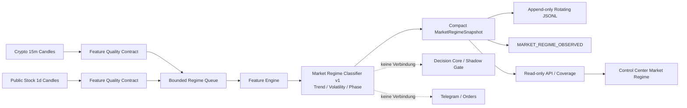

Die Rohkerzenübergabe ist ein direkter interner Funktionsaufruf vom Crypto-/Stock-Adapter zur Queue und kein EventBus-Payload. Der Worker ist Drop-newest, batchfähig, restart-safe und drainiert beim Shutdown. Nur der kompakte versionierte Snapshot wird publiziert und gespeichert.

## Nicht blockierender Stock- und Verification-Lauf

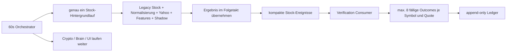

Der Produktions-Orchestrator erstellt keinen überlappenden Stocklauf und wartet nicht auf die blockierende Legacy-/Normalisierungspipeline. Fertige Ergebnisse werden in einem Folgetakt publiziert. Der Verification-Consumer sortiert fällige Fälle nach `evaluation_due_at` und verarbeitet je Stock-Quote höchstens acht. Nicht verarbeitete Fälle bleiben `PENDING` und werden nach Neustart unverändert aus dem Ledger rekonstruiert.

## Verification-Modi, Idempotenz und Ledger-Eigentum

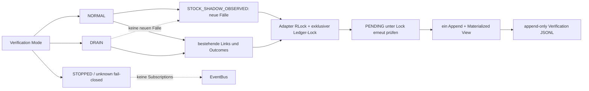

`NORMAL` ist der rückwärtskompatible Erfassungsmodus. `DRAIN` abonniert ausschließlich Decision-, Tracker- und Stock-Quote-Ereignisse für bereits rekonstruierte Fälle. `STOPPED` und unbekannte Werte besitzen keine Verification-Subscriptions. Vor Ledger-Lesen und Subscriptions muss ein exklusiver Prozess-/Dateilock erworben werden; er bleibt bis zum vollständigen Adapter-Stop gehalten. Ein Konflikt setzt den Adapter auf ungesund, veröffentlicht nur den kompakten Fehlerstatus und bleibt ohne Subscriptions. Completion-Selektion, erneute `PENDING`-Prüfung, fsync-Append und In-Memory-Apply liegen unter derselben reentranten Sperre, sodass parallele Quoteereignisse genau eine Completion erzeugen.

## Stock-Datengrenze (read-only Shadow und Audit integriert)

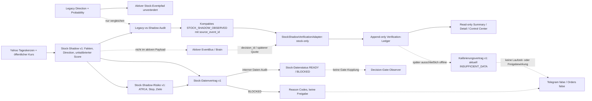

`StockAdapter` baut aus öffentlichen Daten den kompakten Shadow-Kandidaten, ergänzt LONG/SHORT über den getrennten ATR-Risikovertrag und vergleicht ihn mit der Legacy-Placeholder-Decision. `affects_active_decision` ist fest `false`. Vor `STOCK_ANALYSIS_FINISHED` werden Audit, Shadow, Vergleich, Risiko und Providerdiagnostik weiterhin aus dem aktiven Payload entfernt. Additiv entsteht ausschließlich bei vorhandenem Audit eine separate kompakte `STOCK_SHADOW_OBSERVED`-Projektion mit derselben `source_event_id`. Der optionale Verification-Adapter persistiert daraus append-only Fälle, verknüpft die spätere `decision_id` und beobachtet spätere öffentliche Quotes. Der bestehende Legacy-Feature-, Decision-, Signal-, Outcome-, Learning-, Telegram- und Orderfluss verwendet weder Auditkerzen noch Shadow-Richtung oder -Risiko. Rohkerzen bleiben außerhalb aller Event- und History-Payloads.

Summary-Projektionen werden generationsgebunden im Speicher gecacht und nur nach einem neuen append-only Ledger-Eintrag invalidiert. Dadurch lösen der bestehende 1-Sekunden-Poll und WebSocket-Snapshots während eines mehrtägigen Laufs keine vollständige Neuaggregation bei unverändertem Datenstand aus.

Der neue Kalibrierungsvertrag ist keine Laufzeitkomponente. Er beschreibt nur eine mögliche spätere Offline-Auswertung abgeschlossener, deduplizierter Verification-Outcomes. Im aktuellen System existieren weder Fit, Modell noch Kalibrierungsartefakt. Wiederholte Minutenzyklen derselben Tageskerze gelten nicht als unabhängige Fälle; heute stehen null abgeschlossene unabhängige 24h-Outcomes zur Verfügung.

## Systemkontext

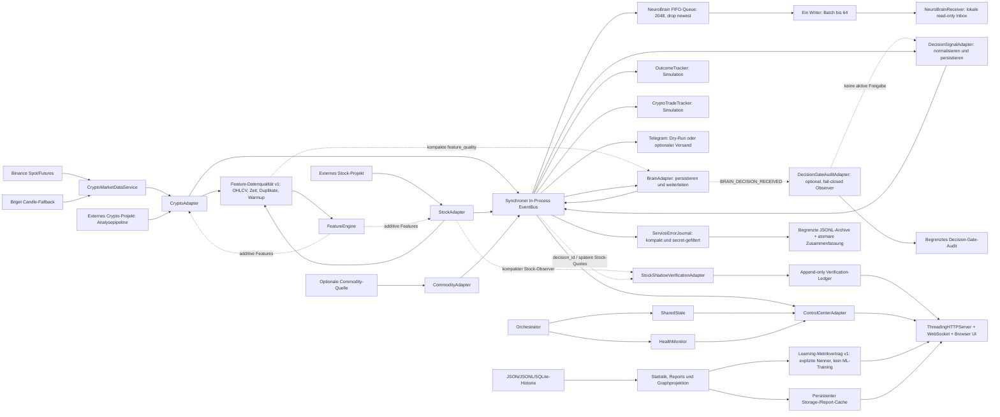

## Prozess- und Lebenszyklusmodell

`main.py` erzeugt den `Orchestrator` und startet abhängig von den CLI-Argumenten einen einzelnen oder kontinuierlichen Lauf. `Orchestrator.start()` startet Adapter sequentiell. Pro Zyklus werden deren `run_once()`-Methoden als AsyncIO-Tasks erstellt und mit `asyncio.gather()` gemeinsam abgewartet. Ein allgemeiner Timeout um alle Adaptertasks existiert nicht. Der Warteabschnitt zwischen Zyklen prüft Stop und Restart höchstens alle 100 Millisekunden. Restart stoppt und startet dieselben Adapterinstanzen im Prozess; bei aktivem Terminal-Control-Center wird dessen Live-Task ebenfalls wieder gestartet. Ein bereits laufender Adapterzyklus wird bewusst nicht hart abgebrochen.

Im Webmodus erzeugt `main.py` zusätzlich `WebControlServer`. Der HTTP-Server läuft als `ThreadingHTTPServer` in einem Hintergrundthread. Periodische Webaufgaben laufen im vorhandenen AsyncIO-Loop; der Storage-Scanner verwendet zusätzlich genau einen eigenen Workerthread.

## Adapter- und Ereignisfluss

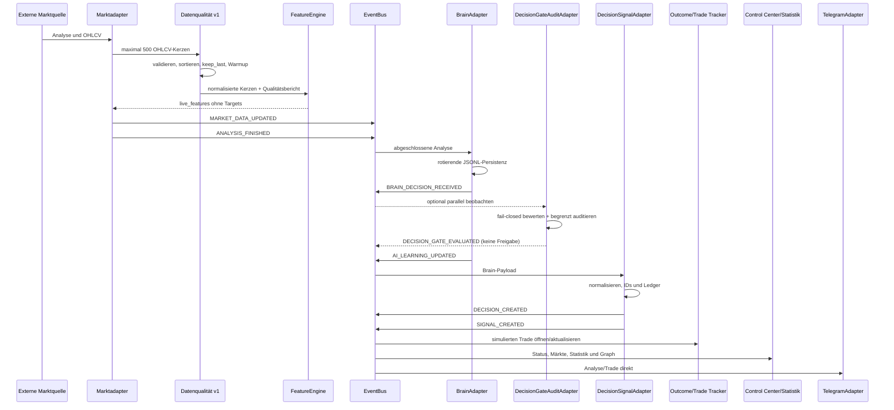

Der `EventBus` kopiert Handler unter einem Lock und führt sie danach synchron im veröffentlichenden Thread aus. Seine `queue_size()` ist die Größe der begrenzten History-Deque und keine Arbeitsqueue.

## Komponentenverantwortung

| Komponente | Tatsächliche Verantwortung | Nicht implementiert |
|---|---|---|
| `CryptoMarketDataService` | Binance-Kerzen, Bitget-Fallback, Retry, optionales Open Interest/Funding | Orders, private APIs |
| `CryptoAdapter` | Normalisierte Marktdaten an externe Crypto-Analyse übergeben, Preise, maximal 500 Kerzen für Features, Fehlerdiagnose, Ereignisse | Börsenorder |
| `StockAdapter` | Externe Aktienanalyse, Preise, maximal 500 Legacy-Kerzen für aktive Features; separater öffentlicher Shadow-/Auditpfad | Börsenorder, Shadow-Umschaltung |
| `stock_shadow_candidate.py` | Versionierter observer-only Score aus öffentlichen Tageskerzen und Kurs, kompakte Fakten/Indikatoren | Kalibrierte Probability, Confidence, Risiko, Eventpublikation, Freigabe |
| `stock_shadow_risk.py` | Expliziter ATR14-Plan mit öffentlichem Entry, Stop und 1R/2R/3R-Zielen | Positionsgröße, aktive Decision, Telegram-/Orderfreigabe |
| `stock_shadow_verification_contract.py` | Deterministische Fall-ID, Statusprojektionen und getrenntes 24h-Forward-Mark-to-Market für Legacy/Shadow | Stop-/Zielpfad-Backtest, Crypto-Vergleich, Kausalitätsaussage |
| `StockShadowVerificationAdapter` | Append-only Stock-Ledger, Restart-Rekonstruktion, Source-/Decision-/Tracker-Verknüpfung, Summary/Detail | Mutation produktiver Decisions/Outcomes, Learning, Telegram, Orders |
| `docs/STOCK_SHADOW_CALIBRATION_CONTRACT.md` | Dokumentiert unabhängige Fälle, Mindestabdeckung, chronologische Validierung, Reliability und Evidenz-Confidence | Laufzeitmodul, trainiertes Modell, automatische Kalibrierung, Gate-/Telegram-/Orderkopplung |
| `CommodityAdapter` | Optionale Rohstoffdaten und Ereignisse | Feature-Engine-Anbindung |
| `feature_data_quality_contract.py` | Versionierte OHLCV-Prüfung, Zeitordnung, `keep_last`-Duplikate, Mindestkerzen, Warmup und Qualitätsbericht | Fachliche Decision-Freigabe |
| `FeatureEngine` | Technische Features, Qualitätsmetadaten und optionale historische Targets | ML-Training, Decision-Gate, New-Candle-Cache |
| `decision_gate_contract.py` | Explizite fail-closed Observer-Bewertung, kompakte Qualitätsprojektion und Reason Codes | Aktive Signal-/Telegram-Freigabe, Orders |
| `DecisionGateAuditAdapter` | Optionaler EventBus-Observer, Duplikatschutz, begrenztes Audit-Ledger | Decision-/Signal-Erzeugung, Telegram-Freigabe, Orders |
| `BrainAdapter` | Rotierende Analysepersistenz und Folgeereignisse | Eigene KI-Inferenz oder Faktenprüfung |
| `DecisionSignalAdapter` | Normalisierung, deterministische IDs, Decision-/Signal-Ledger | Risiko-Policy, Confidence-Gate, Konfliktlösung |
| `OutcomeTracker` | Simulierte allgemeine Trade-Outcomes | Reale Orders |
| `CryptoTradeTracker` | Simulierte Crypto-Trades | Reale Orders |
| `NeuroBrainReceiverAdapter` | Read-only Datei-Inbox, Duplikatschutz, begrenzte FIFO-Queue, Batch-Writer und Flush-Shutdown | Rückkanal in Decision Core |
| `TelegramAdapter` | Dry-Run oder optionaler Nachrichtenversand | Zwingende finale Decision-Freigabe |
| `ControlCenterAdapter` | Kompakte Event-/Statussicht | Stale-Heartbeat-Klassifikation |
| `ServiceErrorJournal` | Versionierte Projektion von Fehlerereignissen, Secret-Filter, begrenzte Rotation, persistente Erst-/Letztbeobachtung | Vollständige Payload-Ablage, zentrale Retention aller anderen Ledger |
| `learning_metrics_contract.py` | Einheitliche Outcome-/Hit-Rate-/Abdeckungsprojektion mit expliziten Zählern und Nennern | ML-Training, Modellbewertung oder Musterlernen |

## Persistenzarchitektur

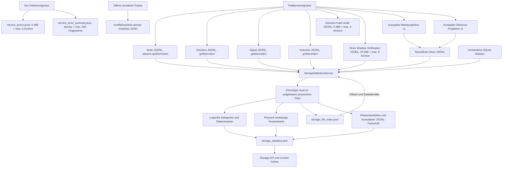

Der Scanner lädt beim Start den letzten Cache. `start_scan()` akzeptiert nur einen laufenden Scan, arbeitet im Hintergrund und liefert unmittelbar Scan-ID und Status zurück. Alle Zielpfade werden logisch beibehalten, aber pro Scan über ihren aufgelösten physischen Pfad dedupliziert. Ein gemeinsamer Dateiergebnis-Cache verhindert wiederholtes Lesen und mehrfachen Budgetverbrauch; die Kategorieansicht erhält weiterhin den jeweils passenden relativen Pfad. `total_*` bezeichnet verifizierte physische Werte, zusätzlich werden `physical_total_*`, `logical_total_*` und `overlapping_file_references` explizit geliefert. Alte Caches ohne diese Felder werden als `LEGACY_CACHE` statt als physisch verifiziert markiert.

JSONL-Dateien werden binär ab dem persistierten Offset gelesen; unvollständige letzte Zeilen werden erst nach einem Zeilenabschluss übernommen. Schrumpfung oder Austausch einer Datei setzt den Index zurück. Ein globales Standardbudget von 64 MiB begrenzt jeden Lauf. Der Scanstatus projiziert kumulativ Gesamt-, indexierte und restliche Bytes, vollständige JSONL-Dateien sowie aus Budget und Intervall abgeleitete Restläufe/-zeit. Große SQLite-, JSON-, CSV- und Logdateien werden nur per Metadaten erfasst. Cache und Index werden über temporäre Dateien und `os.replace()` atomar ersetzt.

Timeout, Abbruch und einzelne verschwundene Dateien beenden nicht die Verfügbarkeit des letzten Caches. Laufzeiten werden für Zielermittlung, Pfadauflösung, Metadaten, Fingerprint, Dateiverarbeitung, Index- und Cachepersistenz getrennt erfasst. Der Realbenchmark mit 64 MiB blieb bei 2,135 Sekunden und damit deutlich unter dem 30-Sekunden-Limit; der Dauerbetrieb muss nach Neustart weiter beobachtet werden.

Das Fehlerjournal wird vor den Adaptern an den Wildcard-Kanal des EventBus gehängt und nach deren Shutdown entfernt. Es speichert Ereignis-/Korrelations-ID, Zeit, Topic, Service, Stufe, Symbol, Provider, Fehlerart und bis zu zehn kompakte Provider-Versuche. Secrets werden anhand sensibler Schlüsselnamen und Textmustern ersetzt; rohe Payloads und Response-Bodies werden nicht persistiert. Eigene Schreibfehler werden im Journal-Health gezählt und nicht an den Publisher weitergeworfen.

Der Scanner besitzt einen eigenen Lebenszyklus-Lock und einen dauerhaften `closed`-Zustand. `start_scan()` lehnt nach `close()` neue Hintergrundscans mit `CLOSED` ab; synchrone `refresh()`-Aufrufe liefern danach nur noch den letzten Snapshot. `close()` setzt das Abbruchsignal und wartet ohne willkürlichen Ein-Sekunden-Abbruch auf den aktiven Worker. Eine Sperrbarriere stellt zusätzlich sicher, dass auch ein synchron laufender Refresh beendet ist. Deshalb kann nach Rückkehr von `close()` kein Cache- oder Index-Schreibvorgang mehr stattfinden. Wiederholtes `close()` ist idempotent.

`atomic_json.py` stellt für kleine, häufig ersetzte Runtime-Zustände einen konfliktresistenten Pfad bereit. Er serialisiert Schreiber auf denselben aufgelösten Zielpfad, schreibt jede Version in eine eigene Temp-Datei im Zielverzeichnis, validiert und `fsync`-t den JSON-Inhalt und ersetzt danach atomar. Transiente Windows-`PermissionError`- beziehungsweise Sharing-Verstöße werden mit kurzen begrenzten Delays erneut versucht; bei endgültigem Fehler wird nur die eigene Temp-Datei aufgeräumt und der Fehler weitergereicht. Aktuell verwenden NeuroBrain-Status und aktive Crypto-Trades diesen Helfer. Beide Adapter halten ihre Zustandssperre bis zum erfolgreichen Replace, damit Snapshot- und Dateireihenfolge übereinstimmen.

Der NeuroBrain-Wildcard-Handler führt keine Dateioperation mehr im Publisher-Thread aus. Er prüft Topic und Duplikat, erstellt die kompakte Projektion und verwendet `put_nowait`. Die Queue ist standardmäßig auf 2048 Einträge begrenzt; bei Überlauf bleibt die bereits akzeptierte FIFO-Reihenfolge erhalten und nur das neueste Ereignis wird mit `dropped_events` abgelehnt. Ein nicht-daemonisierter Worker sammelt bis zu 64 Einträge beziehungsweise 250 Millisekunden und schreibt sie geordnet über `RotatingJsonlLedger.append_many()`. Status- und Receipt-Fehler beenden den Worker nicht. Beim Shutdown wird zuerst abonniertes Neugeschäft gestoppt, danach die Queue vollständig geleert und der Thread gejoint; nach Rückkehr kann kein Queue-Schreibvorgang mehr laufen.

## Webarchitektur

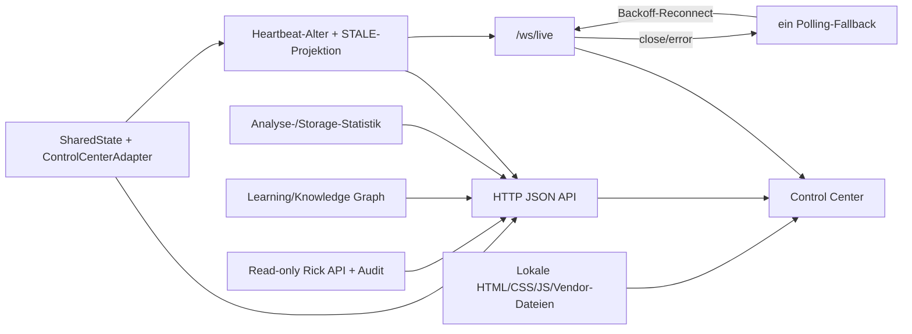

Die Web-API sanitiziert öffentliche Payloads und entfernt Secrets sowie große interne Felder. Markt-/Heartbeat-Broadcasts und Statistikupdates werden gedrosselt. Der Storage-Refresh antwortet asynchron mit HTTP `202`.

Die Browseroberfläche verwendet WebSocket-Liveupdates und genau einen idempotenten HTTP-Polling-Fallback. Polling-Aufrufe sind single-flight. Nach `close` oder `error` startet ein begrenzter exponentieller Reconnect; Verbindungsgenerationen verhindern, dass alte Socket-Callbacks den neuen Zustand überschreiben. Storage- und Learning-Graph-Ladevorgänge sind single-flight. Graphinteraktionen werden mit `requestAnimationFrame` koalesziert; Force-Layoutpositionen werden für unveränderte Knoten-/Kantenstruktur wiederverwendet. Lokale Skripte verwenden `defer` und Cache-Buster.

## Learning- und Outcome-Metrikgrenze

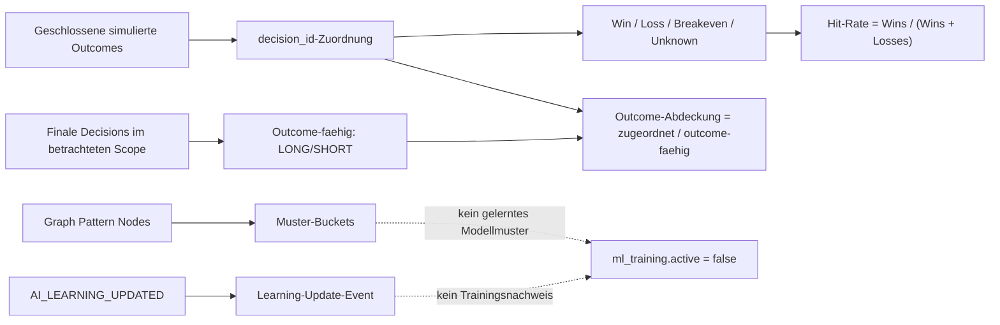

`learning_metrics_contract.py` ist die ausführbare Version-1-Referenz. Report und Trading-Statistik verwenden denselben Hit-Rate-Nenner; Breakeven und unbekannte Outcomes werden separat ausgewiesen. Der Report darf Outcome-Abdeckung nur aus per `decision_id` zugeordneten Outcomes und Decisions desselben geladenen Fensters berechnen. Historische Aggregatzähler liefern keine Abdeckung, wenn ihr Rekonstruktionsscope nicht übereinstimmt. Alle öffentlichen Raten enthalten Zähler und Nenner.

Der Graph benennt beobachtete Kategorien als `pattern_buckets` und Datensätze im geladenen Tagesfenster als `learning_projection_records_today`. Der kumulative Wert `learning_update_events_total` bleibt davon getrennt. Keine dieser Projektionen belegt Modelltraining; Version 1 veröffentlicht deshalb `ml_training_active=false` und `model_updates=0`.

## Sicherheitsgrenzen

- Keine reale Orderausführung im Kern.
- Webserver standardmäßig nur lokal binden.
- Telegram standardmäßig deaktiviert und im Dry-Run.
- Rick- und Steuerendpunkte bei externer Freigabe zusätzlich absichern.
- Secrets ausschließlich über lokale Umgebungskonfiguration bereitstellen.
- Runtime-Historien, Lerndaten und Tokens nicht löschen oder veröffentlichen.
- Externe Legacy-Projekte bleiben außerhalb dieses Repositories und werden nur adaptiert.
- Crypto-Marktdaten verwenden ausschließlich öffentliche read-only HTTP-Endpunkte; Futures-Kontext ist optional und löst keine Orders aus.

## Kompakter Event-Payload-Vertrag

Die produktiv aktiven Verträge `pandorickki.compact-market-event` und `pandorickki.compact-observer-event`, jeweils Version 1, beschreiben die kontrollierte Migration weg von vollständigen Raw Results. Ihre ausführbare Referenz ist `event_payload_contract.py`; Feldmatrix, Topiczuordnung und Migrationsregeln stehen in `docs/EVENT_PAYLOAD_CONTRACT.md`.

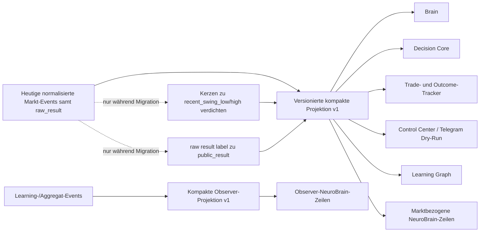

Brain verwendet die Marktprojektion als aktive Eingangsgrenze für neue History und `BRAIN_DECISION_RECEIVED`; Decision Core verwendet sie für neue Decision-/Signal-Events und beide Ledger. NeuroBrain behält eine kompakte Kopfsicht und wählt sein Detailpayload topicbasiert: Learning und aggregierte Aktienupdates verwenden den Observer-Vertrag, einzelwertige Crypto-/Commodity-Updates sowie Analysis-, Brain-, Decision-, Signal- und Trade-Topics den Marktvertrag. Der Crypto Trade Tracker liest `market_context.recent_swing_low/high` und der Learning Graph `public_result` jeweils bevorzugt. Bestehende Payloads und History bleiben über die bisherigen Raw-Lesepfade verfügbar und werden nicht umgeschrieben. Beide NeuroBrain-Schemata sind kontrolliert live verifiziert.

## Crypto-Ausfall- und Fallback-Semantik

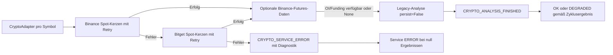

Die projektlokale `.venv` ist Laufzeitisolation, kein Daten- oder Architekturservice. `setup_local_env.bat` legt sie bei Bedarf an, installiert die deklarierte Zeitzonendaten-Abhängigkeit und der Preflight prüft zentrale Dateien, Imports und `America/New_York` vor jedem Batch-Start.

## Bekannte Architekturgrenzen

- Synchroner EventBus ohne allgemeine Backpressure; ausschließlich der NeuroBrain-Dateiconsumer ist inzwischen über eine eigene begrenzte Queue entkoppelt.
- Kein allgemeiner Timeout um jeden Adapterzyklus.
- Ein getesteter fachlicher Decision-Gate-Vertrag existiert, ist aber noch nicht als Observer an den EventBus angeschlossen und greift nicht in Decisions oder Signals ein.
- Telegram liegt nicht strikt hinter finalen Decisions.
- Keine zentrale Retention-Policy für den gesamten Runtime-Bestand.
- Absolute Windows-Pfade begrenzen Portabilität.
- Storage-Scans können trotz inkrementellem Index das Zeitlimit überschreiten.
- `STALE` kann nur für Services mit bekanntem Heartbeat bestimmt werden; heartbeatlose Services behalten ihren sonstigen Status.
- Stop und Restart unterbrechen den Zyklus-Warteabschnitt, nicht einen bereits laufenden Adapterzyklus.
