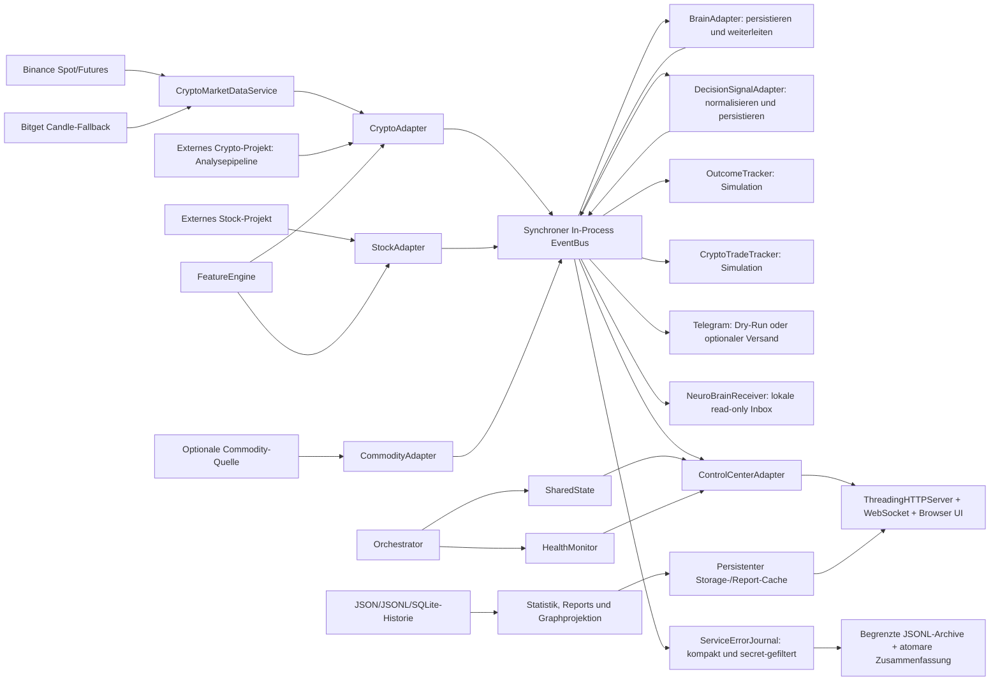
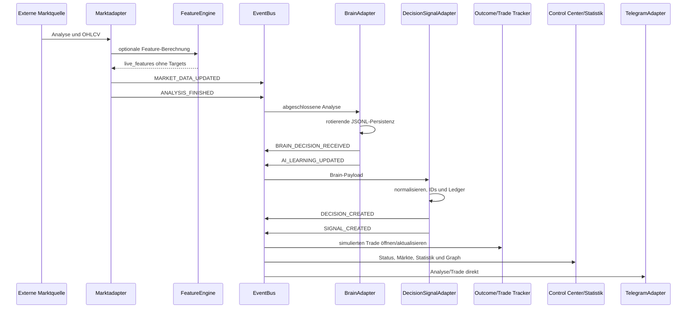
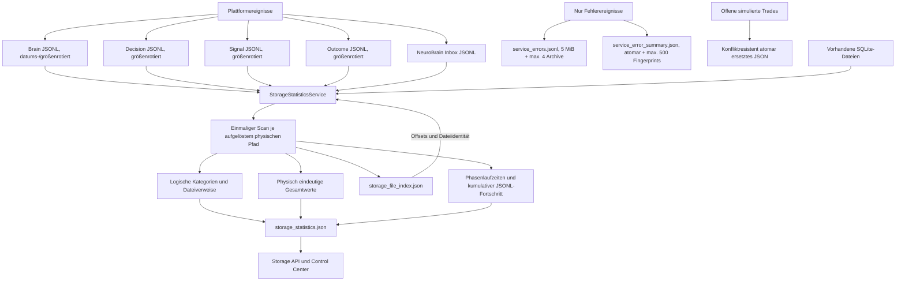
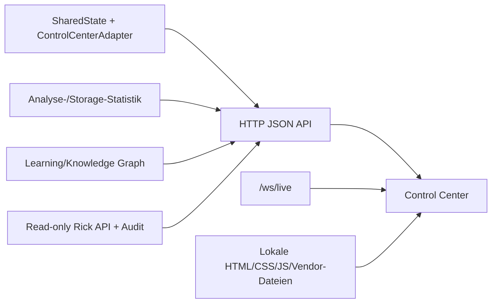
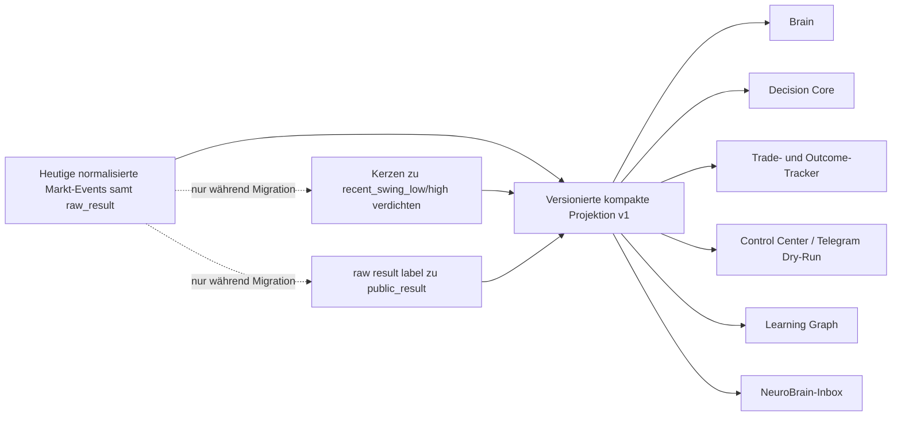
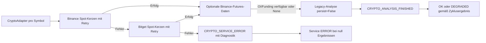

# PandorickKi – Ist-Architektur

Stand: 2. August 2026

Dieses Dokument beschreibt ausschließlich die im aktuellen Code nachweisbare Architektur. Es ist keine Zielarchitektur.

## Systemkontext

## Prozess- und Lebenszyklusmodell

`main.py` erzeugt den `Orchestrator` und startet abhängig von den CLI-Argumenten einen einzelnen oder kontinuierlichen Lauf. `Orchestrator.start()` startet Adapter sequentiell. Pro Zyklus werden deren `run_once()`-Methoden als AsyncIO-Tasks erstellt und mit `asyncio.gather()` gemeinsam abgewartet. Ein allgemeiner Timeout um alle Adaptertasks existiert nicht.

Im Webmodus erzeugt `main.py` zusätzlich `WebControlServer`. Der HTTP-Server läuft als `ThreadingHTTPServer` in einem Hintergrundthread. Periodische Webaufgaben laufen im vorhandenen AsyncIO-Loop; der Storage-Scanner verwendet zusätzlich genau einen eigenen Workerthread.

## Adapter- und Ereignisfluss

Der `EventBus` kopiert Handler unter einem Lock und führt sie danach synchron im veröffentlichenden Thread aus. Seine `queue_size()` ist die Größe der begrenzten History-Deque und keine Arbeitsqueue.

## Komponentenverantwortung

| Komponente | Tatsächliche Verantwortung | Nicht implementiert |
|---|---|---|
| `CryptoMarketDataService` | Binance-Kerzen, Bitget-Fallback, Retry, optionales Open Interest/Funding | Orders, private APIs |
| `CryptoAdapter` | Normalisierte Marktdaten an externe Crypto-Analyse übergeben, Preise, maximal 500 Kerzen für Features, Fehlerdiagnose, Ereignisse | Börsenorder |
| `StockAdapter` | Externe Aktienanalyse, Preise, maximal 500 Kerzen für Features, Ereignisse | Börsenorder |
| `CommodityAdapter` | Optionale Rohstoffdaten und Ereignisse | Feature-Engine-Anbindung |
| `FeatureEngine` | Technische Features und optionale historische Targets | ML-Training, strikte Datenqualitätsverträge |
| `BrainAdapter` | Rotierende Analysepersistenz und Folgeereignisse | Eigene KI-Inferenz oder Faktenprüfung |
| `DecisionSignalAdapter` | Normalisierung, deterministische IDs, Decision-/Signal-Ledger | Risiko-Policy, Confidence-Gate, Konfliktlösung |
| `OutcomeTracker` | Simulierte allgemeine Trade-Outcomes | Reale Orders |
| `CryptoTradeTracker` | Simulierte Crypto-Trades | Reale Orders |
| `NeuroBrainReceiverAdapter` | Read-only Datei-Inbox und Duplikatschutz | Rückkanal in Decision Core |
| `TelegramAdapter` | Dry-Run oder optionaler Nachrichtenversand | Zwingende finale Decision-Freigabe |
| `ControlCenterAdapter` | Kompakte Event-/Statussicht | Stale-Heartbeat-Klassifikation |
| `ServiceErrorJournal` | Versionierte Projektion von Fehlerereignissen, Secret-Filter, begrenzte Rotation, persistente Erst-/Letztbeobachtung | Vollständige Payload-Ablage, zentrale Retention aller anderen Ledger |

## Persistenzarchitektur

Der Scanner lädt beim Start den letzten Cache. `start_scan()` akzeptiert nur einen laufenden Scan, arbeitet im Hintergrund und liefert unmittelbar Scan-ID und Status zurück. Alle Zielpfade werden logisch beibehalten, aber pro Scan über ihren aufgelösten physischen Pfad dedupliziert. Ein gemeinsamer Dateiergebnis-Cache verhindert wiederholtes Lesen und mehrfachen Budgetverbrauch; die Kategorieansicht erhält weiterhin den jeweils passenden relativen Pfad. `total_*` bezeichnet verifizierte physische Werte, zusätzlich werden `physical_total_*`, `logical_total_*` und `overlapping_file_references` explizit geliefert. Alte Caches ohne diese Felder werden als `LEGACY_CACHE` statt als physisch verifiziert markiert.

JSONL-Dateien werden binär ab dem persistierten Offset gelesen; unvollständige letzte Zeilen werden erst nach einem Zeilenabschluss übernommen. Schrumpfung oder Austausch einer Datei setzt den Index zurück. Ein globales Standardbudget von 64 MiB begrenzt jeden Lauf. Der Scanstatus projiziert kumulativ Gesamt-, indexierte und restliche Bytes, vollständige JSONL-Dateien sowie aus Budget und Intervall abgeleitete Restläufe/-zeit. Große SQLite-, JSON-, CSV- und Logdateien werden nur per Metadaten erfasst. Cache und Index werden über temporäre Dateien und `os.replace()` atomar ersetzt.

Timeout, Abbruch und einzelne verschwundene Dateien beenden nicht die Verfügbarkeit des letzten Caches. Laufzeiten werden für Zielermittlung, Pfadauflösung, Metadaten, Fingerprint, Dateiverarbeitung, Index- und Cachepersistenz getrennt erfasst. Der Realbenchmark mit 64 MiB blieb bei 2,135 Sekunden und damit deutlich unter dem 30-Sekunden-Limit; der Dauerbetrieb muss nach Neustart weiter beobachtet werden.

Das Fehlerjournal wird vor den Adaptern an den Wildcard-Kanal des EventBus gehängt und nach deren Shutdown entfernt. Es speichert Ereignis-/Korrelations-ID, Zeit, Topic, Service, Stufe, Symbol, Provider, Fehlerart und bis zu zehn kompakte Provider-Versuche. Secrets werden anhand sensibler Schlüsselnamen und Textmustern ersetzt; rohe Payloads und Response-Bodies werden nicht persistiert. Eigene Schreibfehler werden im Journal-Health gezählt und nicht an den Publisher weitergeworfen.

Der Scanner besitzt einen eigenen Lebenszyklus-Lock und einen dauerhaften `closed`-Zustand. `start_scan()` lehnt nach `close()` neue Hintergrundscans mit `CLOSED` ab; synchrone `refresh()`-Aufrufe liefern danach nur noch den letzten Snapshot. `close()` setzt das Abbruchsignal und wartet ohne willkürlichen Ein-Sekunden-Abbruch auf den aktiven Worker. Eine Sperrbarriere stellt zusätzlich sicher, dass auch ein synchron laufender Refresh beendet ist. Deshalb kann nach Rückkehr von `close()` kein Cache- oder Index-Schreibvorgang mehr stattfinden. Wiederholtes `close()` ist idempotent.

`atomic_json.py` stellt für kleine, häufig ersetzte Runtime-Zustände einen konfliktresistenten Pfad bereit. Er serialisiert Schreiber auf denselben aufgelösten Zielpfad, schreibt jede Version in eine eigene Temp-Datei im Zielverzeichnis, validiert und `fsync`-t den JSON-Inhalt und ersetzt danach atomar. Transiente Windows-`PermissionError`- beziehungsweise Sharing-Verstöße werden mit kurzen begrenzten Delays erneut versucht; bei endgültigem Fehler wird nur die eigene Temp-Datei aufgeräumt und der Fehler weitergereicht. Aktuell verwenden NeuroBrain-Status und aktive Crypto-Trades diesen Helfer. Beide Adapter halten ihre Zustandssperre bis zum erfolgreichen Replace, damit Snapshot- und Dateireihenfolge übereinstimmen.

## Webarchitektur

Die Web-API sanitiziert öffentliche Payloads und entfernt Secrets sowie große interne Felder. Markt-/Heartbeat-Broadcasts und Statistikupdates werden gedrosselt. Der Storage-Refresh antwortet asynchron mit HTTP `202`.

Die Browseroberfläche verwendet WebSocket-Liveupdates und HTTP-Polling. Storage-Snapshots werden single-flight geladen. Lokale Skripte verwenden `defer` und Cache-Buster. Ein belastbarer WebSocket-Reconnect sowie idempotente Polling-Timer fehlen noch.

## Sicherheitsgrenzen

- Keine reale Orderausführung im Kern.
- Webserver standardmäßig nur lokal binden.
- Telegram standardmäßig deaktiviert und im Dry-Run.
- Rick- und Steuerendpunkte bei externer Freigabe zusätzlich absichern.
- Secrets ausschließlich über lokale Umgebungskonfiguration bereitstellen.
- Runtime-Historien, Lerndaten und Tokens nicht löschen oder veröffentlichen.
- Externe Legacy-Projekte bleiben außerhalb dieses Repositories und werden nur adaptiert.
- Crypto-Marktdaten verwenden ausschließlich öffentliche read-only HTTP-Endpunkte; Futures-Kontext ist optional und löst keine Orders aus.

## Kompakter Event-Payload-Vertrag

Der produktiv aktive Vertrag `pandorickki.compact-market-event` Version 1 beschreibt die kontrollierte Migration weg von vollständigen Raw Results. Seine ausführbare Referenz ist `event_payload_contract.py`; die Feldmatrix und Migrationsregeln stehen in `docs/EVENT_PAYLOAD_CONTRACT.md`.

Brain verwendet die Projektion als aktive Eingangsgrenze für neue History und `BRAIN_DECISION_RECEIVED`; Decision Core verwendet sie für neue Decision-/Signal-Events und beide Ledger. NeuroBrain behält eine kompakte Kopfsicht und persistiert als Detailpayload nur noch Version 1. Der Crypto Trade Tracker liest `market_context.recent_swing_low/high` und der Learning Graph `public_result` jeweils bevorzugt. Bestehende Payloads und History bleiben über die bisherigen Raw-Lesepfade verfügbar und werden nicht umgeschrieben. Der dargestellte kompakte Persistenzfluss ist implementiert und kontrolliert live verifiziert; `KP-016` dokumentiert die noch offene Schemaabgrenzung nicht marktbezogener NeuroBrain-Topics.

## Crypto-Ausfall- und Fallback-Semantik

Die projektlokale `.venv` ist Laufzeitisolation, kein Daten- oder Architekturservice. `setup_local_env.bat` legt sie bei Bedarf an, installiert die deklarierte Zeitzonendaten-Abhängigkeit und der Preflight prüft zentrale Dateien, Imports und `America/New_York` vor jedem Batch-Start.

## Bekannte Architekturgrenzen

- Synchroner EventBus ohne Backpressure.
- Kein allgemeiner Timeout um jeden Adapterzyklus.
- Kein fachlich unabhängiges Decision-Gate.
- Telegram liegt nicht strikt hinter finalen Decisions.
- Keine zentrale Retention-Policy für den gesamten Runtime-Bestand.
- Absolute Windows-Pfade begrenzen Portabilität.
- Storage-Scans können trotz inkrementellem Index das Zeitlimit überschreiten.
- Health zeigt Heartbeats, klassifiziert aber keine veralteten Services.
